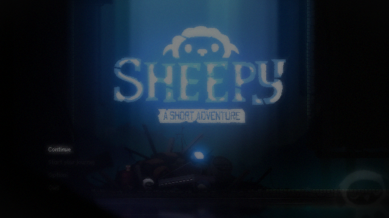

# 이미지 판별 기준 검증 계획

현재 임계값은 초기 관찰에 기반한 휴리스틱이다. 다양한 환경에서 정확도가 검증된 수치로 제시하지 않는다.

| 항목 | 현재 코드 기준 | 검증할 반례 |
| --- | --- | --- |
| 플레이 화면 후보 | 로비 소멸, 변화량 >=0.05, 색상 수 >10 | 컷신·다른 메뉴·전환 중 화면 |
| 입력 반응 | 입력 변화량-무입력 변화량 >=0.005 | 배경 애니메이션·카메라 움직임 |
| 화면 변화 | 변화량 >=0.001, 연속 무변화 10초 미만 | 초반 변화 후 정지·정적 정상 장면 |
| 로비 CTA | 고정 영역에서 주변 평균보다 밝기 3 이상 높은 픽셀 비율 >=0.08 | 배율·창 비율 변경·비슷한 무늬 |
| 언어 후보 | 기존 중앙 색상 조건 + 양옆 어두운 픽셀 비율 >=0.95 | 중앙 색상 블록이 있는 플레이·밝은 주변 배경·어두운 플레이 |

## 자료 작성

정상·오인하기 쉬운 화면에 사람이 정답을 붙인다. 기준 조정용과 평가용을 분리한다. 파일, 정답, 자동 판정, 환경, 오탐/미탐/보류 사유를 기록한다. 평가 자료에서 틀린 결과를 삭제하지 않는다.

현재 별도 정답셋 평가와 임계값 정확도 수치는 미완료이다. 기존 evidence 예시는 정답셋이 아니다. 실제 화면 1회 PASS를 모든 장면에 일반화하지 않는다.

언어 후보의 양옆 영역은 x=10~35%, 68~90%, y=15~88%이다. 평균 RGB 밝기 35 이하를 어두운 픽셀로 센다. 관찰한 언어 화면의 검은 주변 배경과 플레이 장면의 배경을 구분하기 위한 추가 휴리스틱이며 0.95는 정확도가 검증된 수치가 아니다. `sideDarkPixelRatio`를 판정 증거에 함께 기록한다. 기존 중앙 조건은 유지한다.

보관된 플레이 오탐 1장 회귀와 3가지 해상도의 인공 양성/음성 검증이 통과했다. 비공개 언어 캡처 2장(656×399 창 외곽, 1920×1080 전체 화면)의 오프라인 재분석에서도 후보 인식을 유지했다. 두 언어 캡처의 sideDarkPixelRatio는 1.0이다. 이전 캡처 형식의 호환성 확인이며 현재 640×360 렌더링 캡처에서의 실제 TC 통과 근거는 아니다. AI가 대조한 진단 자료로 사람이 라벨링한 독립 평가셋을 대체하지 않는다.

## 재현 가능한 입력 반응 평가

PowerShell에서 저장소 루트를 기준으로 실행한다. pytest의 pythonpath 설정은 일반 Python 명령에 적용되지 않으므로 src를 명시한다.

```powershell
$env:PYTHONPATH = "src"
.\.venv\Scripts\python.exe -m sheepy_qa.image_evaluation docs/samples/image-evaluation-manifest.json --output artifacts/results/image-evaluation.json
```

공개 manifest는 빈 표본이며 `NOT_EVALUATED`가 정상 결과이다. 실제 평가를 주장하지 않는다. 실제 자료는 다음 필드로 구성하고 이미지 경로는 manifest 기준 상대 경로로 작성한다.

```json
{"samples": [{"id": "input-001", "split": "evaluation", "captureSession": "session-001", "expected": "RESPONSE", "reviewer": "실제 검토자", "reason": "화면을 확인하고 기록할 근거", "environment": "빌드·해상도·창 모드", "preconditionsMet": true, "before": "before.png", "idle": "idle.png", "after": "after.png"}]}
```

위 행은 형식 설명이며 정답 표본이 아니다. before→idle은 무입력, idle→after는 입력 구간이며 동일 관찰 간격과 화면 영역을 사용한다. expected는 사람이 확인한 RESPONSE/NO_RESPONSE이다. preconditionsMet는 실제 준비·포커스 관찰 기록에서 가져오며 정답을 보고 바꾸지 않는다. 사전조건이 없으면 REVIEW_REQUIRED로 별도 집계한다.

동일 녹화 세션을 calibration과 evaluation에 나눠 넣는 것을 차단한다. 평가용만 참양성·참음성·오탐·미탐·보류에 집계하며 잘못된 라벨이나 누락 이미지는 오류로 처리한다. 빈 평가셋에는 정확도나 성공률을 만들지 않는다. 로컬 입력 테스트와 임계값 0.005를 공유한다. 화면 후보 인식 전체의 정확도, 점프·이동의 실제 성공 정확도를 측정하는 도구는 아니다.

인공 이미지 회귀 테스트는 평가 도구의 집계와 누출 방지 검증이며 실제 게임 정답셋과 구분한다.

## 어두운 로비 CTA 회귀



이 640×360 표본에서 Start 영역의 상위 밝기는 14로 기존 절대 밝기 기준 25에 못 미쳤다. 절대 밝기만 사용하면 밝은 단색 배경도 메뉴로 분류됐다. 주변 평균(BoxBlur 반경=max(1, 화면 높이/90)) 대비 밝기 차이를 사용하도록 수정했다. 평균 RGB 차이가 3 이상인 픽셀 비율이 0.08 이상이면 CTA 후보로 기록한다. 기존 밝기와 textPixelRatio는 비교용 진단값으로 보존하고 contrastPixelRatio·contrastThreshold를 추가했다.

보관 표본의 Start 대비 비율은 0.0805, 같은 실행의 직전 프레임은 0.0857이다. 두 프레임의 Continue/Start를 인식했고 더 어두운 전환 프레임(0.0571)은 Start로 인정하지 않았다. 검은 화면, 밝은 단색 3종, 완만한 명암 변화, 실제 플레이 표본도 메뉴로 판정하지 않았다. 수정 전 회귀 5개 실패를 재현하고 수정 후 로비 회귀 9개가 통과했다.

기준에 가까운 표본이므로 압축·배율·다른 장면에서 안정성을 보장하지 않는다. 텍스처도 국소 대비를 만들 수 있으며 OCR·메뉴 문구 확인을 대체하지 않는다. 같은 실행의 인접 프레임은 독립 평가셋이 아니다. 이 이미지는 AI가 대조한 진단 자료이고 실제 TC-019 재실행과 사람이 라벨링한 독립 평가가 남아 있다.

## 화면 준비 연결 회귀

`tests/unit/test_screen_session_replay.py`는 보관 로비·플레이 이미지와 인공 검은 화면을 LocalScreenSession.observe에 공급한다. 창 조회·캡처·키 전송·시간은 대체하지만 이미지 분석, 로비 기준 이미지 비교, 화면 분류, ensureScreen은 실제 함수를 사용한다.

로비→BLACK→GAMEPLAY 2초 유지 시 준비 완료와 Enter 1회, BLACK 없는 전환의 준비 보류, 로비 기준 없는 플레이 이미지의 입력 차단, 로딩 후 포커스 상실의 관찰 중단을 검증한다. 연결 회귀 4개와 기존 상태 준비 11개가 통과했다. 합성한 순서와 가상 시간의 검증이며 실제 게임에서 로딩·입력·경과 시간을 재현했다는 의미가 아니다. 수정 후 실제 TC와 3회 반복 검증은 별도로 남아 있다.

2026-09-14 실제 창 외곽 656×399, 게임 표시 영역 640×360을 확인했다. 창 캡처는 제목 표시줄·테두리를 제외한 client 영역으로 변경한다. 전체 화면 캡처 TC-004는 별도 기능이며 게임 상태 판정 근거로 사용하지 않는다. 이전 외곽 이미지와 새 이미지는 직접 비교하지 않는다.
