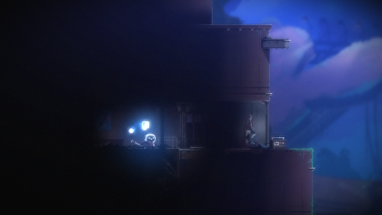

# 실제 게임 재검증 — 2026-09-14

이번 실행은 전체 완료 검증이 아니라 실제 환경에서 사전조건·캡처·판정의 결함을 확인한 진단 실행이다. 로컬 evidence의 UTC 날짜는 2026-09-13이며 KST 기록일은 2026-09-14이다. raw 결과와 검토 결론을 구분한다.

| TC | 실제 결과 | 검토 결론 |
| --- | --- | --- |
| 001/003 | 선택 실행 2 PASS | 실행된 게임 프로세스 관찰. Steam URI 기동 3회 증명 아님 |
| 004 | sandbox FAIL → desktop PASS | 동일 Pillow 캡처가 실행 환경에 따라 달랐다. 전체 바탕화면 증거는 비공개 |
| 019 | 최초 준비 REVIEW → 로비 FAIL, 렌더링 캡처 후도 FAIL | 어두운 Start Your Journey 항목 미감지. 임계값을 낮춰 통과시키지 않음 |
| 010 | raw PASS | 0.812초 증거가 로비 전환 연출. 실제 플레이 진입 완료로 인정하지 않음 |
| 007/012 | 2 PASS | 당시 관찰 구간의 프로세스·캡처·변화 확인. 이후 캡처 수정 후 재검증과 3회 반복은 남음 |
| 006 | FAIL → REVIEW 반복 | 외곽 캡처에서는 로딩 중 입력(delta=-0.118). 렌더링 캡처 후에는 로딩 인식으로 입력 보류. 최종 준비에서 실제 플레이를 LANGUAGE로 오판 |
| 011 및 나머지 미실행 TC | NOT_RUN | 인식 결함 해결 전 입력 확대하지 않음 |

## 수정과 남은 결함

- 게임 창 외곽에는 제목 표시줄과 주변 창 일부가 섞였다. NW.js 렌더링 자식 창 640×360만 캡처하도록 수정했다. GetClientRect만으로는 사용자 지정 제목 표시줄이 남아 실제 자식 창 경계를 사용했다.
- Continue 후 로비 페이드가 GAMEPLAY 후보로 오인됐다. 로딩 BLACK 관찰 후 2초 연속 후보를 요구한다. 로딩 프레임을 놓친 경우는 보류한다.
- 실제 플레이 후보 출현 14.531초를 기록했다. 로컬 준비 대기를 30초로 설정하며 제품 성능 합격 기준과 구분한다. 최초 타임아웃은 보존한다.
- 실제 플레이 화면을 LANGUAGE로 오판했다. 로비 Enter 이후 LANGUAGE가 나타나면 추가 Enter를 보내지 않고 REVIEW로 중단하도록 수정했다. 인식 함수의 오탐 자체는 **미해결**이다.

이미지는 실제 게임 영역만 포함한다. AI가 화면을 대조한 진단 증거이며 사람이 라벨링한 평가셋으로 주장하지 않는다. centralDarkPixelRatio=0.8144, centralSaturatedPixelRatio=0.062, visibleOptionCount=3으로 기존 휴리스틱의 언어 후보 조건을 충족한다. `test_language_real_regression.py`는 실제 플레이를 언어로 분류하지 않아야 한다는 기대값으로 작성했고 현재 `xfail(strict=True)`이다. 알려진 결함을 통과로 집계하지 않으며, 수정돼 XPASS가 발생하면 xfail 표시를 제거하고 검증한다.

## 다음 실제 검증 전 조건

1. 언어 화면/플레이/로비/로딩의 실제 표본에 독립적인 정답을 붙여 화면 분류를 보완한다.
2. Start 항목의 고정 영역·명암 조건을 실제 표본으로 평가한다. 밝은 배경을 글자로 오인하는 반례도 포함한다.
3. 안정된 로비에서 010→006/011을 각각 재준비해 수행한다. 단계별 최초 결과와 재시도를 분리한다.
4. 수정 후 정상 흐름 3회와 실패 차단 증거를 확보하기 전 최종본 완료로 표시하지 않는다.

게임 파일·세이브는 직접 수정하거나 삭제하지 않았다. 수동 메뉴 탐색 Escape→Down→Down→Enter로 Quit 후 로비 복귀를 확인했으며 이 경로를 아직 자동 복구 기능으로 구현하지 않았다.
