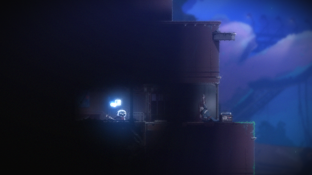
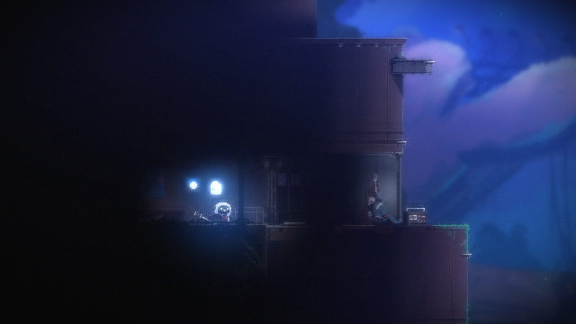
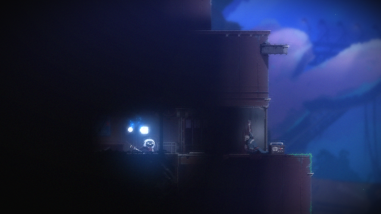
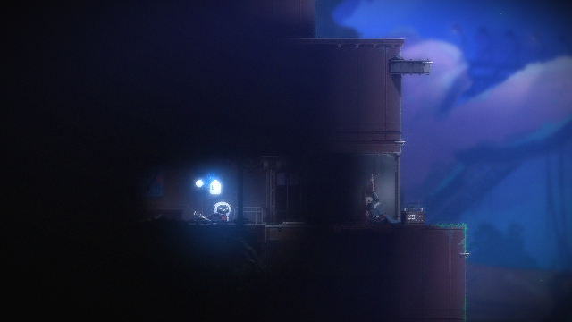
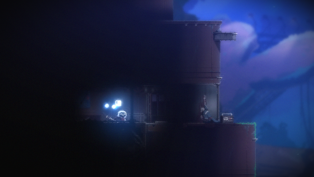
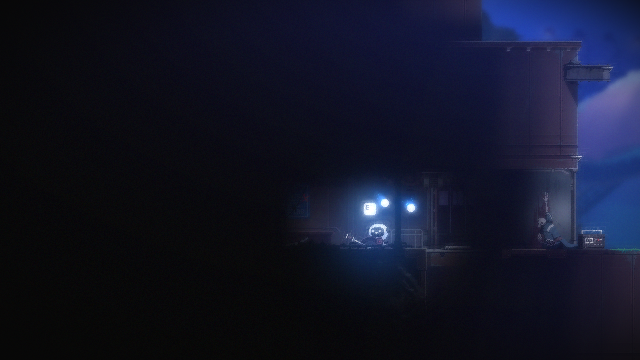

# 실제 게임 재검증 — 2026-09-15

코드 `d731c87`의 크기 변경 차단·예외 이벤트 보존 수정 후 정상 흐름을 확인했다. 사용자가 실행해 둔 플레이 화면에서 Escape 메뉴를 열고 Quit 선택을 캡처로 확인해 로비로 복귀했다. 각 TC 전에 이 과정을 다시 수행했다. 창 외곽 656×399, 게임 캡처 640×360. 게임 build·OS 배율은 이번에 재확인하지 않았다. 게임·세이브 파일은 직접 변경하지 않았다.

| TC / UTC 실행 ID | 결과 | 확인한 근거 |
| --- | --- | --- |
| TC-010 / 2026-09-14T15-28-42.085+00-00-TC-010 | PASS 1회 | 로비 Enter 후 BLACK→2초 이상 GAMEPLAY 유지. 약 14.7초 준비 완료, 마지막 캡처도 플레이 장면 |
| TC-006 / 2026-09-14T15-31-00.441+00-00-TC-006 | PASS 1회 | 별도 로비 준비 후 Space 시각 반응. 무입력 변화 0.0132, 입력 변화 0.0391, 차이 0.0259 >= 0.005 |

KST 실행 시각은 각각 00:28, 00:31이다. `SHEEPY_RUN_STEAM_TESTS=1`에서 `python -m pytest -m tc_010 -q -p no:cacheprovider`, 이어 별도 로비 준비 후 `-m tc_006`을 실행했다. 각 결과는 `1 passed, 131 deselected`이다. 두 실행의 준비·관찰에서 포커스와 캡처 크기가 유지됐고 예외가 발생하지 않았다.

[TC-010 준비 이벤트](samples/TC-010-0915-preparation.json) · [TC-010 판정](samples/TC-010-0915-judgement.json) · [TC-006 판정](samples/TC-006-0915-judgement.json) · [시각 반응 수치](samples/TC-006-0915-response.json)

## TC-006 화면 대조

준비 완료 → 무입력 관찰 → Space 입력 후 순서이다. AI가 실제 게임 영역을 대조했으며 독립적인 사람 정답셋으로 사용하지 않는다.

입력 후 이미지에는 카메라·배경 위치 변화도 포함된다. PASS는 무입력 대비 시각 반응 조건 충족이며 점프 성공을 확정하지 않는다. 한 장의 입력 후 캡처로 점프 전체 동작을 검증하지 않는다.

## 남은 검증

이번은 수정 후 정상 경로 1회씩이다. 실제 크기 변경·캡처 오류를 주입해 이벤트 보존을 검증한 것은 아니다. 이전 TC-010 PASS는 이전 코드의 별도 실행이며 최신 코드 3회 반복으로 합산하지 않는다. 동일 시작 조건 반복, 짧은 안정성 최신 재검증, 독립 이미지 평가가 남아 있다. 이전 실패·보류 이력은 [9월 14일 기록](live-validation-2026-09-14.md)에 유지한다.

## TC-011 방향키 시각 반응

2026-09-15 07:03 KST, 코드 `f0b3200`(실행 코드 변경 없음), 실행 ID `2026-09-14T22-03-19.776+00-00-TC-011`. 실행 중인 플레이 화면에서 Escape→메뉴 Quit 선택을 캡처로 확인해 로비로 복귀했다. 이전 TC의 플레이 기준 이미지를 재사용하지 않고 새 세션에서 준비했다. 캡처 640×360, 창 외곽 656×399. 게임 build·OS 배율은 재확인하지 않았다.

`SHEEPY_RUN_STEAM_TESTS=1`에서 `python -m pytest -m tc_011 -q -p no:cacheprovider` 결과 **1 passed, 131 deselected**. 플레이 준비 후 오른쪽 0.15초→왼쪽 0.15초 입력 콜백을 실행했다. input-log의 actionPerformed=true, error=null이다. 무입력 변화량 0.0121, 입력 변화량 0.3606, 차이 **0.3485 >= 0.005**로 시각 반응 조건을 충족했다.

[PASS 판정](samples/TC-011-0915-judgement.json) · [반응 수치](samples/TC-011-0915-response.json)

AI가 대조한 마지막 캡처는 플레이 장면이며 캐릭터·배경 위치 변화가 보인다. 카메라 이동도 변화량에 포함된다. 양방향 각각의 이동 거리·방향 정확성이나 원위치 복귀를 검증한 것은 아니다. 각 방향 사이의 캡처가 없어 두 입력을 분리해 평가할 수 없다. 이번은 최초 시각 반응 PASS 1회이며, 게임 파일·세이브는 직접 변경하지 않았다.
