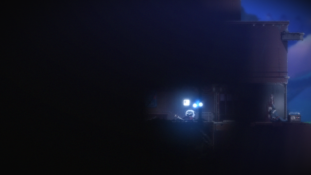
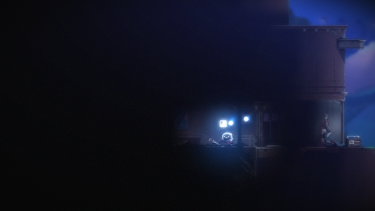

# 실제 게임 재검증 — 2026-09-15

코드 `d731c87`의 크기 변경 차단·예외 이벤트 보존 수정 후 정상 흐름을 확인했다. 사용자가 실행해 둔 플레이 화면에서 Escape 메뉴를 열고 Quit 선택을 캡처로 확인해 로비로 복귀했다. 각 TC 전에 이 과정을 다시 수행했다. 창 외곽 656×399, 게임 캡처 640×360. 게임 build·OS 배율은 이번에 재확인하지 않았다. 게임·세이브 파일은 직접 변경하지 않았다.

| TC / UTC 실행 ID | 결과 | 확인한 근거 |
| --- | --- | --- |
| TC-010 / 2026-09-14T15-28-42.085+00-00-TC-010 | PASS 1회 | 로비 Enter 후 BLACK→2초 이상 GAMEPLAY 유지. 약 14.7초 준비 완료, 마지막 캡처도 플레이 장면 |
| TC-006 / 2026-09-14T15-31-00.441+00-00-TC-006 | PASS 1회 | 별도 로비 준비 후 Space 시각 반응. 무입력 변화 0.0132, 입력 변화 0.0391, 차이 0.0259 >= 0.005 |

KST 실행 시각은 각각 00:28, 00:31이다. `SHEEPY_RUN_STEAM_TESTS=1`에서 `python -m pytest -m tc_010 -q -p no:cacheprovider`, 이어 별도 로비 준비 후 `-m tc_006`을 실행했다. 각 결과는 `1 passed, 131 deselected`이다. 두 실행의 준비·관찰에서 포커스와 캡처 크기가 유지됐고 예외가 발생하지 않았다.

[TC-010 준비 이벤트](samples/TC-010-0915-preparation.json) · [TC-010 판정](samples/TC-010-0915-judgement.json) · [TC-006 판정](samples/TC-006-0915-judgement.json) · [시각 반응 수치](samples/TC-006-0915-response.json)

## TC-006 화면 대조

준비 완료 → 무입력 관찰 → Space 입력 후 순서이다. AI가 실제 게임 영역을 대조했으며 독립적인 사람 정답셋으로 사용하지 않는다.

입력 후 이미지에는 카메라·배경 위치 변화도 포함된다. PASS는 무입력 대비 시각 반응 조건 충족이며 점프 성공을 확정하지 않는다. 한 장의 입력 후 캡처로 점프 전체 동작을 검증하지 않는다.

## 남은 검증

이번은 수정 후 정상 경로 1회씩이다. 실제 크기 변경·캡처 오류를 주입해 이벤트 보존을 검증한 것은 아니다. 이전 TC-010 PASS는 이전 코드의 별도 실행이며 최신 코드 3회 반복으로 합산하지 않는다. 동일 시작 조건 반복과 독립 이미지 평가가 남아 있다. 이전 실패·보류 이력은 [9월 14일 기록](live-validation-2026-09-14.md)에 유지한다.

## TC-011 방향키 시각 반응

2026-09-15 07:03 KST, 코드 `f0b3200`(실행 코드 변경 없음), 실행 ID `2026-09-14T22-03-19.776+00-00-TC-011`. 실행 중인 플레이 화면에서 Escape→메뉴 Quit 선택을 캡처로 확인해 로비로 복귀했다. 이전 TC의 플레이 기준 이미지를 재사용하지 않고 새 세션에서 준비했다. 캡처 640×360, 창 외곽 656×399. 게임 build·OS 배율은 재확인하지 않았다.

`SHEEPY_RUN_STEAM_TESTS=1`에서 `python -m pytest -m tc_011 -q -p no:cacheprovider` 결과 **1 passed, 131 deselected**. 플레이 준비 후 오른쪽 0.15초→왼쪽 0.15초 입력 콜백을 실행했다. input-log의 actionPerformed=true, error=null이다. 무입력 변화량 0.0121, 입력 변화량 0.3606, 차이 **0.3485 >= 0.005**로 시각 반응 조건을 충족했다.

[PASS 판정](samples/TC-011-0915-judgement.json) · [반응 수치](samples/TC-011-0915-response.json)

AI가 대조한 마지막 캡처는 플레이 장면이며 캐릭터·배경 위치 변화가 보인다. 카메라 이동도 변화량에 포함된다. 양방향 각각의 이동 거리·방향 정확성이나 원위치 복귀를 검증한 것은 아니다. 각 방향 사이의 캡처가 없어 두 입력을 분리해 평가할 수 없다. 이번은 최초 시각 반응 PASS 1회이며, 게임 파일·세이브는 직접 변경하지 않았다.

## 짧은 안정성 재검증

2026-09-15 07:08~07:10 KST, 코드 `f927336`(실행 코드 변경 없음). 현재 플레이 장면을 확인한 후 조작 입력 없이 TC-007, TC-012를 순서대로 실행했다. 창 외곽 656×399, 캡처 640×360. 각 테스트는 창 활성화를 시도하며 관찰 중 매 샘플의 포커스를 기록하는 테스트는 아니다. 게임·세이브 파일은 직접 변경하지 않았다.

| TC / UTC 실행 ID | 결과 | 관찰 범위 |
| --- | --- | --- |
| TC-007 / 2026-09-14T22-08-34.693+00-00-TC-007 | PASS 1회 | 목표 30초, 샘플 7개 모두 프로세스 존재·캡처 저장 확인, 실패 샘플 0 |
| TC-012 / 2026-09-14T22-09-35.117+00-00-TC-012 | PASS 1회 | 목표 20초, 캡처 5장·비교 4개 모두 변화 관찰, 연속 무변화 0초 |

`SHEEPY_RUN_STEAM_TESTS=1`에서 `python -m pytest -m tc_007 -q -p no:cacheprovider`, 이어 `-m tc_012`를 실행했다. 각각 `1 passed, 131 deselected`, pytest 소요 시간 37.04초와 26.02초이다. 목표 관찰 시간은 테스트 전체 실행 시간과 다르다. TC-012 실제 캡처 시각은 시작 후 약 0.687, 6.375, 12.062, 17.781, 23.500초로, 관찰·캡처 비용 때문에 정확히 5초 간격은 아니다.

[TC-007 요약](samples/TC-007-0915-summary.json) · [판정](samples/TC-007-0915-judgement.json) · [TC-012 요약](samples/TC-012-0915-summary.json) · [시각과 원본 파일명](samples/TC-012-0915-samples.json) · [판정](samples/TC-012-0915-judgement.json)

TC-012 변화 비율 평균은 0.0083, 최댓값은 0.0139이다. 첫·마지막 이미지를 대조했고 같은 플레이 장면에서 빛 효과 변화가 보였다. 아래는 원본 첫·마지막 캡처의 공개 복사본이다. 원본 전체 경로와 중간 캡처는 로컬 evidence에 보관한다.

PASS는 해당 샘플의 프로세스·저장 유지 및 화면 변화 조건 충족이다. 샘플 사이의 일시적 정지, 내부 로직 정지, 장시간 안정성은 입증하지 않는다. 두 테스트 모두 이번 실행 1회이며 동일 조건 3회 반복은 남아 있다.

## 안정성 동일 장면 3회 관찰

2026-09-15 18:50~18:55 KST, 코드 `9860587`. 시작 시 게임 창이 감지되지 않아 Steam URI로 실행을 요청했다. 20초 안에 창을 찾지 못했으며 이후 Steam 기동 지연으로 늦게 실행됐다는 사용자 확인과 실제 창 관찰이 있었다. 이 20초 조회 결과를 TC-003 통과로 합산하지 않는다.

영어 선택 후 안내 종료와 Continue 로비를 확인했다. `2026-09-15T09-50-13.446+00-00-REPEAT-STABILITY-PREPARATION`에서 플레이 준비 완료 후 최종 이미지를 대조했다. 이전 안정성 관찰 장면과 캐릭터 위치가 달라 과거 1회를 합산하지 않고 새 묶음으로 3회씩 실행했다.

조건은 동일 프로세스, 창 외곽 656×399, 캡처 640×360, 준비한 플레이 장면에서 이동 입력 없음이다. 세이브·게임 파일은 직접 변경하지 않았고 매 회차 재기동·재로드하지 않았다. build·OS 배율은 재확인하지 않아 검증된 환경 범위를 확장하지 않는다. 각 실행의 첫·마지막 캡처를 AI가 대조해 같은 플레이 장면이 유지됨을 확인했다. 전체 캡처 33장의 크기도 동일했다.

| 회차 | TC-007 (UTC 실행 시각) | TC-012 (UTC 실행 시각) |
| --- | --- | --- |
| 1 | 09:50:57.904 PASS, 6개 샘플 유지 | 09:51:32.084 PASS, 4개 비교 모두 변화 |
| 2 | 09:52:28.154 PASS, 6개 샘플 유지 | 09:53:02.468 PASS, 4개 비교 모두 변화 |
| 3 | 09:54:16.175 PASS, 6개 샘플 유지 | 09:54:50.485 PASS, 4개 비교 모두 변화 |

각 회차 `SHEEPY_RUN_STEAM_TESTS=1`에서 `python -m pytest -m 'tc_007 or tc_012' -q -p no:cacheprovider`를 실행했다. 세 실행 모두 `2 passed, 130 deselected`, 소요 시간은 각각 62.52, 62.33, 62.72초이다. [전체 실행 ID와 집계](samples/stability-repeat-0915.json)는 로컬 원본 judgement·summary·sample timeline에서 추린 자료이며 원본 자체를 대체하지 않는다.

TC-007 마지막 관찰은 30.20/30.39/30.34초였다. TC-012 마지막 캡처는 25.235/25.062/25.391초이며 관찰·캡처 비용으로 목표 20초와 다르다. 세 번 모두 연속 무변화 집계 0초였다.

**완료 범위: 이 장면에서 TC-007·012 각 3회 반복 관찰.** 게임 기동 3회, 시작 상태 복원 3회, 다른 장면·장시간 안정성은 검증하지 않았다. 로비·진입·입력 TC의 독립 반복과 실제 오류 상황·이미지 평가는 남아 있다.
